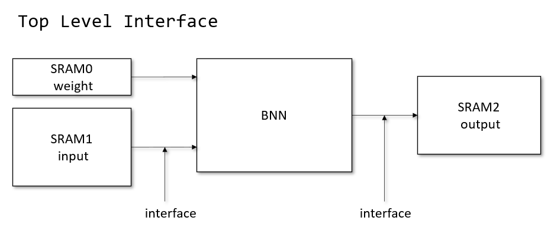
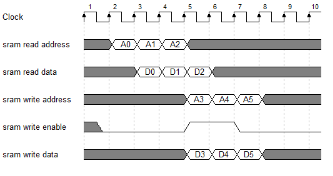
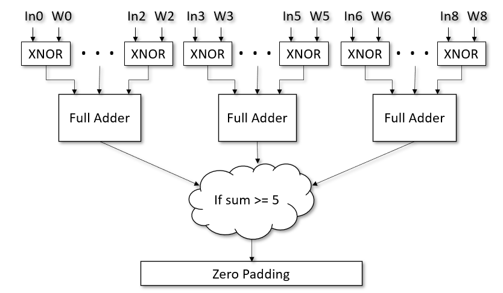
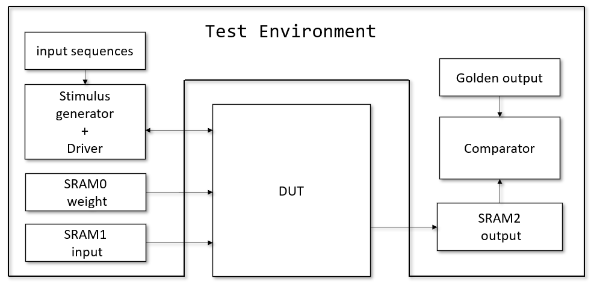
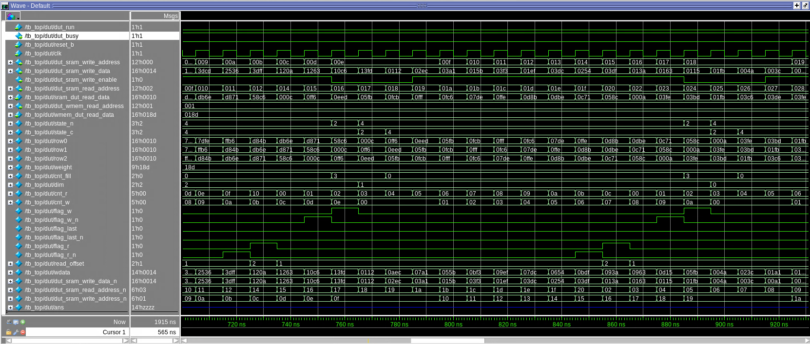

<p align="center", style="font-size:140%;"> <b>NC State University<br><br>
Department of Electrical and Computer Engineering
<br><br>ECE 564: ASIC and FPGA Design with Verilog Fall 2021
<br><br>Project: Binary Artificial Neural Network
<br><br><br><br>by <br><br><br><br>Zong-Ru Li<br><br><br><br><br>
</b></p>

<br><br><br><br>
<br><br><br><br>

### **Abstract**
Since 2015, binary neural networks have became popular because they require less computing resources and compute faster than traditional neural networks. This project aims to investigate different microarchitecture and synthesis optimization techniques to design a high-performance binary neural network ASIC. To reach the best performance, I compare the result of four binary convolution microarchitectures and five synthesis optimization techniques. My result shows that using parallelized small adders has a faster critical path than using one big adder. Results also reveal that using netlist optimization and removing unnecessary reset registers can shrink the total cell area. However, the final area may be disturbed by logic on non-critical paths. From a safety perspective, this study emphasizes that each process of front-end ASIC has a significant impact on final performance. Besides, this study mentions the need to consider the impact of logic on non-critical paths along with total cell area.

<div class="page"/>

# Table of Contents
- [1. **Introduction**](#1-introduction)
- [2. **High Level Prototype**](#2-high-level-prototype)
  * [2.1 Discussion of high level modeling](#21-discussion-of-high-level-modeling)
  * [2.2 High Level Synthesis Results](#22-high-level-synthesis-results)
- [3. **Interface Specification**](#3-interface-specification)
  * [3.1 Top Level Interface](#31-top-level-interface)
  * [3.2 Signal Description](#32-signal-description)
  * [3.3 SRAM interface timing diagram](#33-sram-interface-timing-diagram)
  * [3.4 matrix data format](#34-matrix-data-format)
- [4. **Micro-Architecture**](#4-micro-architecture)
  * [4.1 Finite State Machine and Data flow](#41-finite-state-machine-and-data-flow)
  * [4.2 Four Different Binary Convolution microarchitecture](#42-four-different-binary-convolution-microarchitecture)
- [5. **Verification**](#5-verification)
  * [5.1 Generate test pattern](#51-generate-test-pattern)
  * [5.2 Test Environment](#52-test-environment)
- [6. **Synthesis Results Achieved**](#6-synthesis-results-achieved)
  * [6.1 My Synthesis flow](#61-my-synthesis-flow)
  * [6.2 Synthesis Steps](#62-synthesis-steps)
  * [6.3 Techniques for Performance Area Optimization](#63-techniques-for-performance-area-optimization)
- [7. **Simulation Result**](#7-simulation-result)
- [8. **Conclusions**](#8-conclusions)

<div class="page"/>

# 0. **Directory structure**

```
+project/
    +--- 00_Prototype/
    |   |--- NN.h
    |   |--- NN.cpp
    |   \--- NN_tb.cpp
    |
    +--- 01_TESTBED/
    |   |--- testbench_564.sv
    |   +--- input_0/ (input, weight, golden_output dat files)
    |   +--- input_1/ (input, weight, golden_output dat files)
    |
    +--- 02_RTL/
    |   \--- MyDesign.v
    |
    +--- 03_SYN/
    |   |--- Makefile
    |   |--- syn.tcl
    |   |--- setup.tcl
    |   |--- read.tcl
    |   |--- Constraints.tcl
    |   |--- CompileAnalyze.tcl
    |   +--- Report_{clock_cycle}_{date}/
    |   \--- area_total_cell_{clock_cycle}.txt
```
<div class="page"/>

# 1. **Introduction**
- In this project, I implement a single stage of an all binary convolutional neural network. All the weights and input data are binary. They take on values of -1 and 1, which are represented by 0 and 1, respectively. My design reads the input matrix and weight matrix from two SRAMs, and it writes the output matrix to another SRAM. The size of the weight matrix is fixed at 3x3. Besides, the size of the input matrix has three options: 16x16, 12x12, 10x10. Please refer to **project_spec.pdf** file for detail specification.

- Compared with traditional 2-d convolution, binary convolution consume fewer resource and compute faster. 

- I will introduce four different microarchitectures of binary neural network(BNN) accelerator. Also, I will discuss five different synthesis optimization techniques and analysis the trade-off of each optimization. 

# 2. **High Level Prototype**
## 2.1 Discussion of high level modeling

- BNN.h
```
#include <ap_int.h>

#define WORDSIZE 16 // bits per word
#define uint16 unsigned int

typedef ap_uint<16> bit16;
typedef ap_uint<9> bit9;
typedef ap_uint<6> bit6;
typedef ap_uint<4> bit4;
typedef ap_uint<3> bit3;
typedef ap_uint<2> bit2;
typedef ap_uint<1> bit1;

void BNN( bit16 dim1, bit9 W, bit16* In, bit16* Out);
bit PE(bit9 W, bit9 A);     // process element
```
- BNN.cpp
```
#include "BNN.h"
#define A(i) (bit9(bit6(bit3(p2(2+i,0+i)).concat(bit3(p1(2+i,0+i))))).concat(bit3(p0(2+i,0+i))))

void BNN(bit16 dim1, bit9 W, bit16* input, bit16* output){
#pragma HLS INTERFACE s_axilite port=return
#pragma HLS INTERFACE s_axilite port=dim1
#pragma HLS INTERFACE s_axilite port=weight
#pragma HLS INTERFACE m_axi depth=50 max_widen_bitwidth=32 port=input bundle=input_r
#pragma HLS INTERFACE m_axi depth=50 max_widen_bitwidth=32 port=output bundle=output_r

    bit2 dim;
    bit4 dim1o = dim1-3+1 ;
    bit16 sram_input[16];
    bit16 sram_output[16];
    bit16 p0;
    bit16 p1;
    bit16 p2;
    bit16 conv;

    dim[1] = dim1[4];
    dim[0] = dim1[2];

    loop_input: for(int i=0;i<16;++i){
        if(dim[1]){
            sram_input[i]= input[i];
        }else if(dim[0] & (i<12)){
            sram_input[i]= input[i];
        }else if(i<10){
            sram_input[i]= input[i];
        }
    }
    loop_conv :for(int i=0;i<dim1o+2;++i){
#pragma HLS pipeline II=1
        if(i<dim1){
            p0 = p1;
            p1 = p2;
            p2 = sram_input[i];
        }

            conv[15]=0;
            conv[14]=0;
            conv[13]=(dim[1])? PE(W,A(13) ) : (bit)0;
            conv[12]=(dim[1])? PE(W,A(12) ) : (bit)0;
            conv[11]=(dim[1])? PE(W,A(11) ) : (bit)0;
            conv[10]=(dim[1])? PE(W,A(10) ) : (bit)0;
            conv[9]= (dim[1]|dim[0])? PE(W,A(9) ) : (bit)0;
            conv[8]= (dim[1]|dim[0])? PE(W,A(8) ): (bit)0;
            conv[7]= (dim[1]|dim[0])? PE(W,A(7) ): (bit)0;
            conv[6]= PE(W,A(6) );
            conv[5]= PE(W,A(5) );
            conv[4]= PE(W,A(4) );
            conv[3]= PE(W,A(3) );
            conv[2]= PE(W,A(2) );
            conv[1]= PE(W,A(1) );
            conv[0]= PE(W,A(0) );

        if(i>=2){ // 14 2-15 2-11, 2-9
            sram_output[i-2] = conv;
        }
    }

    loop_output: for(int i=0;i<dim1o;++i){
        output[i] = sram_output[i];
    }
}
bit PE(bit9 W, bit9 A){
    bit9 conv = ~(W^A);
    bit4 sum = conv[0]+conv[1]+conv[2]+conv[3]+conv[4]+conv[5]+conv[6]+conv[7]+conv[8];
    bit Z = ((sum)>4);
    return Z;
}

```
## 2.2 High Level Synthesis Results


Graph 1. Result of high-level-synthesis using Xilinx Vitis_HLS 2020.2 edition
 
The input format in prototyping is the NxN matrix, which is slightly different from the spec of this project(NxN matrix + 1 rows indicate dimension).
Also, the protocol of input and output control, AXI Master, is different from this project's spec. Therefore the iteration latency and trip count is a little bit different with RTL design.

The result of high-level-synthesis has pipeline interval = 1, iteration latency = 3. The result means I have three pipe stages in loop_conv, and the throughput of convolution is 1 row per cycle. 

# 3. **Interface Specification**
## 3.1 Top Level Interface


Graph 2. top level interface

## 3.2 Signal Description

|name|source|width|Description|
|---|---|---|---|
|clock|Clock source|1| Global clock signal |
|reset_b|Reset source|1| Global reset signal, active LOW. |

Table 1: global signals

|name|source|width|Description|
|---|---|---|---|
|dut_wmem_read_address|BNN|12| index of weight matrix. since TA modified spec and fixed size of weight matrix to, this sram index is fixed at 1.|
|wmem_dut_read_data|SRAM 0| 16| Only read weight matrix. weight dimension is fixed to 3.|

Table 2: SRAM 0 channel signals

|name|source|width|Description|
|---|---|---|---|
|dut_sram_read_address|BNN|12| index of read matrix|
|sram_dut_read_data|SRAM 1| 16| read data from read sram, it can be matrix dimension or one row of input matrix|

Table 3: SRAM 1 channel signals

|name|source|width|Description|
|---|---|---|---|
|dut_sram_write_address|BNN|12| index of wright matrix|
|dut_sram_write_data|SRAM 2| 16| write one row of output matrix to output sram|
|dut_sram_write_enable|BNN| 1| weight data|

Table 4: SRAM 2 channel signals

## 3.3 SRAM interface timing diagram

Graph 3. SRAM interface timing diagram<br>
Note: at clock period 7, SRAM write at address A5 failed since SRAM write enable is low.

## 3.4 matrix data format

1. SRAM 1 stores all input matrixes as the following format:
```
@0  1100                // first matrix has 12 rows
@1  1100                // first matrix has 12 columns
@2  0000111111111111    // row 0 of matrix 1, zero padding first 4 bits
@3  0000111010111001    // row 1 of matrix 1
...
@d  0000101011111001    // row 11 of matrix 1
@e  1010                // second matrix has 10 rows
@f  1010                // second matrix has 10 columns
...
```
2. SRAM 0 stores one weight matrix as the following format:
```
@0  11                  // size of weight matrix is fixed at 3.
@1  0000000110101011    // the lowest 9 bits stores weight matrix
//  row 0: 011
//  row 1: 101
//  row 2: 110
```
3. SRAM 2 stores all output matrixes as the following fromat:
```
@0  0011010111010110    // first row of matrix 1
@1  0011110110011011
...
@1f 0000000010110001    // last row of matrix 3
```
# 4. **Micro-Architecture**

## 4.1 Finite State Machine and Data flow

Graph 4. Micro-architecture block diagram


Graph 5. FSM block diagram.<br> Note: flag_w means write done.

1. Control logic: 
    - SRAM controller
    - Finite State Machine: mealy machine 
2. Data flow: 

    - First, store SRAM data in four register arrays. 
    - Second, use the value of the register array to do binary convolution in the process element. 
    - Third, zero-padding the result of binary convolution according to matrix's dimension. 
    - Fourth, store the result in the output register array and write to the output SRAM.

<div class="page"/>

## 4.2 Four Different Binary Convolution microarchitecture
- microarchitecture 1: one 9-input big adder

    
    Graph 6. one 9-input big adder

    logic to compare if sum > 5:
    ```
    wire [3:0] sum; // max sum = 9 = 1001
    assign sum = conv[0] + conv[1] + conv[2] + conv[3] + conv[4] + conv[5] + conv[6] + conv[7] + conv[8];
    // only 4 possible cases : 0101 0110 0111 1000 1001
    assign Z_o = sum[3] | (sum[2]&(sum[1]|sum[0]));
    ```

<div class="page"/>

- microarchitecture 2: two 4-input medium adders

    

    Graph 6. two 4-input medium adders

    logic to compare if sum >= 5:

    ```
    wire [2:0] sum1;
    wire [2:0] sum2;
    assign sum1 = conv[0]+conv[1]+conv[2]+conv[3];
    assign sum2 = conv[4]+conv[5]+conv[6]+conv[7];
    // assume minimum of each (sum1, sum2,conv[8])
    // (4,1,x)   (1,4,x)
    // (3,2,x)   (2,3,x)
    // (3,1,1)   (1,3,1)
    // (2,2,1)
    assign Z_o =(sum1[2]&((|sum2)|conv[8])) |
                (sum2[2]&((|sum1)|conv[8])) |
                // (3,2,x) or (3,1,1)
                (sum1[1]&sum1[0] & (sum2[2]|sum2[1]| (sum2[0]&conv[8]) ) ) |
                // (2,3,x) or (1,3,1)
                (sum2[1]&sum2[0] & (sum1[2]|sum1[1]| (sum1[0]&conv[8]) ) ) |
                (sum1[1]&sum2[1]&conv[8]);
    ```
<div class="page"/>

- microarchitecture 3: three 3-input full adders

    

    Graph 7. three 3-input full adders

    logic to compare if sum >= 5:
    ```
    wire [1:0] sum1;
    wire [1:0] sum2;
    wire [1:0] sum3;
    assign sum1 = conv[0]+conv[1]+conv[2];
    assign sum2 = conv[3]+conv[4]+conv[5];
    assign sum3 = conv[6]+conv[7]+conv[8];
    // all possible case of (sum1,sum2,sum3)
    // (sum1>=2,sum2>=2,sum3>=1)  
    // (sum1>=2,sum2>=1,sum3>=2) 
    // (sum1>=1,sum2>=2,sum3>=2)
    // (3,1,1)  (1,3,1)   (1,1,3)

    assign Z_o = (sum1[1]&sum1[0] & sum2[0] & sum3[0]) |    // (3,1,1) 
                (sum1[0] & sum2[1]&sum2[0] & sum3[0]) |     // (1,3,1) 
                (sum1[0] & sum2[0] & sum3[1]&sum3[0]) |     // (1,1,3) 
                // (sum1>=2,sum2>=2,sum3>=1)
                (sum1[1]&sum2[1] & ((sum1[0]|sum2[0]|sum3[1]|sum3[0])) ) |  
                // (sum1>=2,sum2>=1,sum3>=2)
                (sum1[1]&sum3[1] & ((sum1[0]|sum3[0]|sum2[1]|sum2[0])) ) |  
                // (sum1>=1,sum2>=2,sum3>=2)
                (sum2[1]&sum3[1] & ((sum2[0]|sum3[0]|sum1[1]|sum1[0])) );   
    ```
<div class="page"/>

- microarchitecture 4: four 2-input half adders

    

    Graph 8. four 2-input half adders

    logic to compare if sum >= 5:
    ```
    wire [1:0] sum1;
    wire [1:0] sum2;
    wire [1:0] sum3;
    wire [1:0] sum4;
    assign sum1 = conv[0]+conv[1];
    assign sum2 = conv[2]+conv[3];
    assign sum3 = conv[4]+conv[5];
    assign sum4 = conv[6]+conv[7];

    // assume minimum of each (sum1,sum2,sum3,sum4,conv[8])
    // (2,2,1,0,*0), *conv[8] can only be 1 or 0. 
    // (2,1,1,1,*0)
    // (1,1,1,1,*1)
    assign Z_o =
    // 6 combination of 2,2,1,0,*0
    (sum1[1]&sum2[1] & (sum3[1]|sum3[0]|sum4[1]|sum4[0]|conv[8])) |
    (sum3[1]&sum4[1] & (sum1[1]|sum1[0]|sum2[1]|sum2[0]|conv[8])) |
    (sum1[1]&sum3[1] & (sum2[1]|sum2[0]|sum4[1]|sum4[0]|conv[8])) |
    (sum1[1]&sum4[1] & (sum3[1]|sum3[0]|sum2[1]|sum2[0]|conv[8])) |
    (sum2[1]&sum3[1] & (sum1[1]|sum1[0]|sum4[1]|sum4[0]|conv[8])) |
    (sum2[1]&sum4[1] & (sum3[1]|sum3[0]|sum1[1]|sum1[0]|conv[8])) |
    // 12 combination of 2,1,1,1,*0
    (sum1[1]&(sum2[0]&sum3[0]&sum4[0])) |
    (sum1[1]&(sum2[0]&sum3[0]&conv[8])) |
    (sum1[1]&(sum2[0]&sum4[0]&conv[8])) |
    (sum1[1]&(sum3[0]&sum4[0]&conv[8])) |

    (sum2[1]&(sum1[0]&sum3[0]&sum4[0])) |
    (sum2[1]&(sum1[0]&sum3[0]&conv[8])) |
    (sum2[1]&(sum1[0]&sum4[0]&conv[8])) |
    (sum2[1]&(sum3[0]&sum4[0]&conv[8])) |

    (sum3[1]&(sum1[0]&sum2[0]&sum4[0])) |
    (sum3[1]&(sum1[0]&sum2[0]&conv[8])) |
    (sum3[1]&(sum1[0]&sum4[0]&conv[8])) |
    (sum3[1]&(sum2[0]&sum4[0]&conv[8])) |

    (sum4[1]&(sum1[0]&sum2[0]&sum3[0])) |
    (sum4[1]&(sum1[0]&sum3[0]&conv[8])) |
    (sum4[1]&(sum1[0]&sum2[0]&conv[8])) |
    (sum4[1]&(sum2[0]&sum3[0]&conv[8])) |
    // 1,1,1,1,1
    (sum1[0]&sum2[0]&sum3[0]&sum4[0]&conv[8]);
    ```

<br>
<br>
<br>
<br>
<br>
<br>
<br>

# 5. **Verification**

## 5.1 Generate test pattern

1. generated input sequences 

    - random weight matrixes
    - random input matrixes
    - Total 6 order

        ```
        Oder 1: 16x16, 12x12, 10x10
        Oder 2: 16x16, 10x10, 12x12
        Oder 3: 10x10, 16x16, 12x12
        Oder 4: 10x10, 12x12, 16x16
        Oder 5: 12x12, 16x16, 10x10
        Oder 6: 12x12, 10x10, 16x16
        ```
2. generated golden output sequence using high-level prototype C model

## 5.2 Test Environment


Graph 9. block diagram of the test environment


# 6. **Synthesis Results Achieved**

## 6.1 My Synthesis flow
1. pick the fastest microarchitecture.

    In Table 5, microarchitecture 3, three full adders have the fastest critical path. Therefore I selected this microarchitecture and continued to synthesize and optimization.

    |---|algo1|algo2|algo3|algo4|
    |---|---|---|---|---|
    |clock period(ns)|10|10|10|10|
    |Slack|5.64 | 6.25|6.29 |5.73 |

    Table 5: Slack of four different algorithms

2. develop scripting to automatically synthesis
    
    The script will automatically synthesize from clock "X""1" to "X""9". For example, if we set "X" as "2.4", it will synthesize from clock period 2.41 to 2.49. Also, it merges each netlist's setup-time slack, hold-time slack, total cell area into one single file.

    Another script can grab error and warning messages automatically from dc_shell.log

3. analysis result, try different coding styles, and go back to step 2.

<br>
<br>
<br>

## 6.2 Synthesis Steps
1. setup

    Script setup parameters such as clock period, top module names, Verilog file directory, report file directory.

2. read

    Script read Verilog files.

3. constraint

    Script setup constraints such as clock uncertainty, register clock to Q delay, input port delay, output port delay

4. set_optimized_registers true (optional)

    I will discuss this technique in chapter 6.3.

5. compile_ultra

6. optimized_netlist -area (optional)

    I will discuss this technique in chapter 6.3.

7. Analysis

    Script check_design, translate to fastest process corner and fixed potential hold time violation., translate back to slowest process corner and fixed potential setup violation.

8. output files

    Script output Netlist file, area report, max/min timing reports, SDF(standard delay format) files 


## 6.3 Techniques for Performance Area Optimization

1. Optimizing Critical Path

    The critical path is sensitive to clock period and affects cell area significantly. In this project, a critical path occurs at process element(PE) submodules. Therefore, microarchitecture decides the length of the critical path and how fast clock frequency our design can reach. 

    |---|algo1|algo2|algo3|algo4|
    |---|---|---|---|---|
    |clock period(ns)|10|10|10|10|
    |Slack|5.64 | 6.25|6.29 |5.73 |

    Table 5: Slack of four different algorithms

    The result shows that smaller and parallelized adders have a shorter critical path. However, the overhead of comparing the output signal of adders increases when we increase parallelizing. Therefore, the best microarchitecture is maximum parallelizing adders with only a slight increase in signals that need comparison in non-parallelized logic.

2. Optimizing Non-Critical Path:

    However, non-critical paths don't have critical path's characteristic. I can't find a clear relation between non-critical paths and cell areas. For example, I tried two different coding styles in part of logic and remained all the rest. The two coding styles show as follows:
    
    case 1. cell area: 1394
    ```
    assign flag_w_n = (dim[1])? (cnt_w==4'd13)
                    : (dim[0])? (cnt_w==4'd9)
                    :           (cnt_w==4'd7);
    ```

    case 2. cell area: 1756

    ```
    assign flag_w_n = (dim[1])? cnt_w[3]&cnt_w[2]&cnt_w[0]
                    : (dim[0])? cnt_w[3]&cnt_w[0]
                    :           &cnt_w[2:0];
    ```
    
    | |case 1|case 2|
    |---|---|---|
    |clock period(ns)|2.44|2.44|
    |cell area|1394|1756|

    Table 6. comparing cell area of two different coding style

    In case 1 operator "==" compares 4 bits. In case 2, I only use two AND gates for each comparison. However, the cell area of case 1 is much smaller than case 2. I guess Synopsys Design Compiler automatically chooses some DesignWareIP in case 1, or it luckily finds a way to optimize the compare logic with another part. In conclusion, this result is unexpected and uncontrolled by coding style. The only way I can optimize non-critical paths is to try all the possible coding styles (sharing logic, pipelining, bitwise operation ..., etc.) and hope one of them works.

3. Optimizing Registers

    Use synthesis command: ```set_optimized_registers true``` before compile_ultra<br> This command lets Design Compiler select faster register cells and achieve the fastest clock period. However, register optimization will lead to a huge cell area and got a medium overall performance. Moreover, some lucky case in non-critical path optimization that has smaller cell area does not occur when I compile with the register optimization command. Eventually, I gave up using the register optimization synthesis command.

   |set_optimized_registers |true | true| false|
    |---|---|---|---|
    |clock period(ns)|2.19|2.44|2.44|
    |cell area|1776|1700|1394|
    |cycles|44|44|44|
    |(clk * cycle * area)^-1|5.84e-6|5.48e-6|6.68e-6|

    Table 7. comparing performance and cell area with/without optimizing registers.

4. Optimizing Netlist Area

    Use synthesis command: ```optimize_netlist -area``` 1. after compile_ultra 2. before fix potential hold-time violation. The ```optimize_netlist -area``` command performs monotonic gate-to-gate optimization to improve area without degrading timing or leakage.

   |set_optimized_registers |true | false|
    |---|---|---|
    |clock period(ns)|2.44|2.44|
    |cell area| 1394|1433|

    Table 8. comparing cell area with/without optimizing netlist area.

5. Optimizing unnecessary signal reset

    For some **internal** pipeline registers, its value can be recovered by itself during pipelining. Therefore it is safe to use non-reset Flip-Flops for these registers.

    |Optimizing unnecessary reset |true | false|
    |---|---|---|
    |clock period(ns)|2.44|2.44|
    |cell area| 1433|1452| 


# 7. **Simulation Result**

In this chapter, I will discuss the result of simulation and calculate throughput, including Iteration Latency(IL), Initial Iteration(II), Trip Count(TC).

- Throughput:

    - Throughput is defined as how many rows in matrix are computed per clock cycle.<br>
    - In my RTL design, **throughput = 1** (unit: row/cycle)

- Pipeline Iteration Latency calculation:

    ||Iteration Latency (cycles)|
    |---|---|
    |input |1|
    |convolution|3|
    |output|1|
    |Total|5|

    Table 9. IL of each pipeline

- Trip Count:
    - read rows from input SRAM<br>Trip count = n row of matrix + 1 dimension = n+1 rows

    |matrix|Trip Count (cycles)|
    |---|---|
    |16x16|17|
    |12x12|13|
    |10x10|11|
    |Total|41|

    Table 10. TC of matrixes

| |latency(cycles)| Iteration Latency|Initial Iteration|Trip Count|
|---|---|---|---|---|
|16x16|19|3|1|17|
|12x12|15|3|1|13|
|10x10|13|3|1|11|
|Total|43|3|1|41|

Table 11. IL, II, TC of convolution pipeline

Since I use mealy machine in my RTL design, I save one clock cycle of the first sram input latency.<br> 
**Final latency = convolution latency + output latency = 43+1=44 (cycles)**
<br>

**Final Performance = 1/ (clock period * latency * area) = 1/(Delay * area) = 1/(147322) = 0.00000678785 = 6.78785e-6**

||value|
|---|---|
|clock period(ns)|2.438|
|latency(cycles)|44|
|Delay(ns)|107.272|
|cell area(um)|1373.35|
|Delay*area|147322|
|Performance|6.78785e-6|

Table 12. final result


Graph 10. the waveform of computing 16x16 matrix



Graph 11. the waveform of computing 12x12 matrix


Graph 12. the waveform of computing 10x10 matrix

# 8. **Conclusions**

The result shows that smaller and parallelized adders have a shorter critical path. However, the overhead of processing the output of adders increases when we increase parallelizing. Therefore, the best microarchitecture is maximum parallelized adders with a slight increase in signals that need to process in non-parallelized comparison.

While we all know that a smaller logic path has better performance, this only happens in a critical path. In non-critical paths, the result shows the relation between logic paths and overall cell area is vague. Sometimes minimizing the logic in non-critical paths even make the overall cell area larger.
